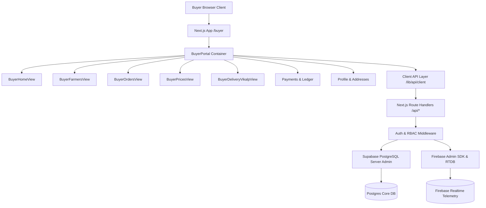

# KRISHISETU — BUYER PORTAL PRODUCTION IMPLEMENTATION SPECIFICATION
**Document Reference**: `docs/BUYER-PORTAL-IMPLEMENTATION.md`  
**Application**: KrishiSetu / AI MANDI  
**Subsystem**: Buyer Portal (क्रेता सेतु / Kisan Bazaar)  
**Version**: 1.0.0 (Production-Ready)  

---

## 1. System Architecture

The KrishiSetu Buyer Portal implements an enterprise-grade, micro-modular architecture built atop Next.js (App Router), Supabase PostgreSQL, Firebase Authentication & Realtime Telemetry, and TailwindCSS / Vanilla UI tokens. 



---

## 2. Route Architecture

The portal leverages clean, unified, and deep-linkable route conventions:

| Route Path | Component | Purpose |
|---|---|---|
| `/buyer` | `src/app/buyer/page.tsx` | Main Buyer Portal SPA entry point with responsive tab controller. |
| `/buyer?tab=HOME` | `BuyerHomeView.tsx` | Discovery dashboard, nearby produce, categories, recommendations. |
| `/buyer?tab=BROWSE` | `BuyerHomeView.tsx` | Filtered produce marketplace catalogue. |
| `/buyer?tab=ORDERS` | `BuyerOrdersView.tsx` | Order history, tracking stepper, cancellations, ratings. |
| `/buyer?tab=FARMERS` | `BuyerFarmersView.tsx` | Verified farmer and FPO collective directory. |
| `/buyer?tab=PRICES` | `BuyerPricesView.tsx` | Bazaar Bhav mandi benchmark prices, price alerts, trends. |
| `/buyer?tab=DELIVERY_VIKALP` | `BuyerDeliveryVikalpView.tsx` | Delivery method selection, carrier options, checkout. |
| `/buyer?tab=PAYMENTS` | `BuyerPortal.tsx` | Payment ledger, escrow overview, transactions. |
| `/buyer?tab=SAVED` | `BuyerPortal.tsx` | Bookmarked / favorite produce listings. |
| `/buyer?tab=SETTINGS` | `BuyerPortal.tsx` | Profile details, saved addresses, preferences. |
| `/buyer?tab=HELP` | `BuyerPortal.tsx` | 24x7 toll-free helpline, WhatsApp, expandable FAQs. |

---

## 3. Modular Component Hierarchy

Rather than a single unmaintainable monolithic component, the Buyer Portal is partitioned into focused, testable, and reusable modules:

1. **`BuyerPortal.tsx`**: Top-level Shell B controller managing navigation, search bar with Web Speech recognition, persistent multi-item cart drawer, notification center modal, and Krishi AI launcher.
2. **`BuyerHomeView.tsx`**: Hero trust banner, category chips, near-you listing grid, product cards with real photo thumbnails, quantity steppers, and active farmer filter chips.
3. **`BuyerFarmersView.tsx`**: Directory grid of verified farmers and FPOs, rating chips, member counts, direct phone dialer links, and "Suggest FPO" form.
4. **`BuyerOrdersView.tsx`**: Order history categorized by status (All, Placed, Packed, In Transit, Delivered, Cancelled), tracking modal with live GPS route visualization, and invoice generation.
5. **`BuyerPricesView.tsx`**: Mandi price tables, interactive SVG 7-day price trend line charts, multi-mandi comparisons, and price threshold alert creator.
6. **`BuyerDeliveryVikalpView.tsx`**: Checkout process comparing Smart Delivery partners against Self Pick-up, FreshRoute perishability validation, address selection, and atomic order placement.
7. **`GoogleMandiMap.tsx`**: Leaflet/OSM map component rendering pickup location, destination, live transporter GPS marker, and route polyline.
8. **`KrishiAIAssistantModal.tsx`**: Multilingual conversational AI assistant helping buyers find crops, analyze price trends, and calculate logistics feasibility.

---

## 4. API Endpoints Contract

The Buyer Portal interacts with backend APIs using strictly authenticated JSON payloads:

### Produce & Marketplace
- `GET /api/listings`: Retrieve active produce listings with query parameters (`category`, `farmerId`, `crop`, `maxDistanceKm`).
- `GET /api/listings/:id`: Fetch complete specifications for a specific listing.

### Shopping Cart
- `GET /api/buyer/cart`: Fetch persistent cart items for the authenticated buyer.
- `POST /api/buyer/cart`: Upsert item and quantity into cart.
- `PATCH /api/buyer/cart/:id`: Update item quantity with stock revalidation.
- `DELETE /api/buyer/cart/:id`: Remove item from cart.

### Orders & Checkout
- `POST /api/orders`: Atomic order checkout with inventory reservation and transporter assignment.
- `GET /api/orders`: Fetch orders belonging to the authenticated buyer.
- `GET /api/orders/:id`: Authoritative order detail.
- `POST /api/orders/:id/cancel`: Cancel placed order if permitted by lifecycle status.
- `POST /api/orders/calculate-pricing`: Server-side pricing calculation separating produce subtotal, transport charge, and platform fee.

### Transport & Logistics
- `GET /api/transport/transporters`: Fetch active duty transporters for carrier selection.
- `GET /api/transport/options`: Evaluate candidate transporters against route distance and FreshRoute constraints.
- `GET /api/shipments/:id`: Fetch shipment tracking state and GPS coordinates.

### Market Prices & Alerts
- `GET /api/market-prices`: Real AGMARKNET mandi prices filtered by state, district, commodity.
- `GET /api/buyer/price-alerts`: Fetch active price alerts for the buyer.
- `POST /api/buyer/price-alerts`: Create new threshold alert.
- `DELETE /api/buyer/price-alerts/:id`: Disable or remove price alert.

### Profile & Addresses
- `GET /api/buyer/profile`: Retrieve buyer profile, contact, and business details.
- `PATCH /api/buyer/profile`: Update buyer settings and preferences.
- `GET /api/buyer/addresses`: List saved delivery addresses.
- `POST /api/buyer/addresses`: Add new delivery address.
- `PATCH /api/buyer/addresses/:id`: Update delivery address.
- `DELETE /api/buyer/addresses/:id`: Delete delivery address.

### Saved Bookmarks
- `GET /api/buyer/saved`: Fetch bookmarked listing IDs and details.
- `POST /api/buyer/saved`: Bookmark a produce listing.
- `DELETE /api/buyer/saved/:id`: Remove listing from saved items.

---

## 5. Database Schema & Entity Mappings

```sql
-- Core Buyer Entities in Supabase PostgreSQL
CREATE TABLE buyer_profiles (
    id UUID PRIMARY KEY DEFAULT gen_random_uuid(),
    user_id UUID REFERENCES users(id) ON DELETE CASCADE UNIQUE NOT NULL,
    business_name VARCHAR(255),
    buyer_type VARCHAR(50) NOT NULL DEFAULT 'CONSUMER', -- 'CONSUMER' or 'BULK_BUYER'
    gstin VARCHAR(20),
    preferred_language VARCHAR(10) NOT NULL DEFAULT 'hi',
    default_delivery_pincode VARCHAR(10),
    created_at TIMESTAMPTZ DEFAULT NOW(),
    updated_at TIMESTAMPTZ DEFAULT NOW()
);

CREATE TABLE buyer_addresses (
    id UUID PRIMARY KEY DEFAULT gen_random_uuid(),
    buyer_id UUID REFERENCES users(id) ON DELETE CASCADE NOT NULL,
    full_name VARCHAR(255) NOT NULL,
    phone VARCHAR(20) NOT NULL,
    address_line1 TEXT NOT NULL,
    address_line2 TEXT,
    landmark VARCHAR(255),
    city VARCHAR(100) NOT NULL,
    district VARCHAR(100) NOT NULL,
    state VARCHAR(100) NOT NULL DEFAULT 'Uttar Pradesh',
    pincode VARCHAR(10) NOT NULL,
    is_default BOOLEAN NOT NULL DEFAULT false,
    created_at TIMESTAMPTZ DEFAULT NOW()
);

CREATE TABLE saved_listings (
    id UUID PRIMARY KEY DEFAULT gen_random_uuid(),
    buyer_id UUID REFERENCES users(id) ON DELETE CASCADE NOT NULL,
    listing_id UUID REFERENCES produce_listings(id) ON DELETE CASCADE NOT NULL,
    created_at TIMESTAMPTZ DEFAULT NOW(),
    UNIQUE(buyer_id, listing_id)
);

CREATE TABLE buyer_cart_items (
    id UUID PRIMARY KEY DEFAULT gen_random_uuid(),
    buyer_id UUID REFERENCES users(id) ON DELETE CASCADE NOT NULL,
    listing_id UUID REFERENCES produce_listings(id) ON DELETE CASCADE NOT NULL,
    quantity_kg NUMERIC(10, 2) NOT NULL,
    created_at TIMESTAMPTZ DEFAULT NOW(),
    updated_at TIMESTAMPTZ DEFAULT NOW(),
    UNIQUE(buyer_id, listing_id)
);

CREATE TABLE price_alerts (
    id UUID PRIMARY KEY DEFAULT gen_random_uuid(),
    buyer_id UUID REFERENCES users(id) ON DELETE CASCADE NOT NULL,
    commodity VARCHAR(100) NOT NULL,
    target_price NUMERIC(10, 2) NOT NULL,
    condition VARCHAR(20) NOT NULL DEFAULT 'BELOW', -- 'BELOW' or 'ABOVE'
    district VARCHAR(100),
    is_active BOOLEAN NOT NULL DEFAULT true,
    created_at TIMESTAMPTZ DEFAULT NOW()
);
```

---

## 6. Authentication, Security & RBAC Enforcement

1. **Server-Side Identity Derivation**:
   - Private operations call `authenticateRequest(req, ['BUYER'])`.
   - The buyer's UUID is resolved strictly from the decoded JWT token (`user.uid`).
   - Requests providing an arbitrary `buyerId` or `userId` in the body/query are discarded.
2. **Row-Level Security (RLS)**:
   - RLS policies on `orders`, `buyer_addresses`, `buyer_cart_items`, `saved_listings`, and `buyer_profiles` ensure buyers can only read and mutate their own records (`auth.uid()::text = buyer_id::text`).
3. **Immutability of State Machines**:
   - Buyers can cancel orders only in `PLACED` status.
   - Buyers cannot accept farmer orders, assign transporters, or confirm delivery unilaterally.

---

## 7. Checkout Workflow & Domain Rule Compliance

### Strict Money Separation (Domain Rules R-001 & R-004)
$$\text{Farmer Revenue} = \text{askingPricePerKg} \times \text{quantityKg}$$
$$\text{Buyer Total} = \text{Farmer Revenue} + \text{Delivery Fee} + \text{Platform Fee}$$
* The delivery fee is paid by the Buyer and credited 100% to the transporter.
* For `SELF_PICKUP`, $\text{Delivery Fee} = ₹0$.
* Platform fee is ₹0 for MVP.
* The farmer's payout is never docked to subsidize transportation.

### Atomic Concurrency & Overselling Prevention
When placing an order:
1. Begin PostgreSQL transaction.
2. Select listing row `FOR UPDATE` to acquire an exclusive row lock.
3. Check `available_quantity >= requested_quantity`.
4. Update listing: `available_quantity = available_quantity - requested_quantity`, `reserved_quantity = reserved_quantity + requested_quantity`.
5. Insert order row in `orders` table.
6. Commit transaction.

---

## 8. FreshRoute Logistics Algorithm

Freshness is a hard operational delivery criterion. For perishable produce:
$$\text{Safety Margin} = 4\text{ hours}$$
$$\text{Allowed Transit Time} = \text{freshnessWindowHours} - \text{Safety Margin}$$
$$\text{FreshRoute Status} = \begin{cases} 
\text{SAFE} & \text{if } \text{Transporter ETA} \le \text{Allowed Transit Time} \\ 
\text{AT\_RISK} & \text{if } \text{Allowed Transit Time} < \text{Transporter ETA} \le \text{freshnessWindowHours} \\ 
\text{INELIGIBLE} & \text{if } \text{Transporter ETA} > \text{freshnessWindowHours} 
\end{cases}$$

Transporters classified as `INELIGIBLE` are automatically disabled from selection in the checkout UI.

---

## 9. Multilingual System (Hindi & English)

All UI strings, badges, category filters, and error messages are rendered dynamically through `LanguageContext` using translation keys (`t(key)`):
- Navigation: `nav_home`, `nav_marketplace`, `nav_orders`, `nav_farmers`, `nav_bazaar_bhav`, `nav_delivery_vikalp`.
- Checkout: `checkout_title`, `delivery_mode_smart`, `delivery_mode_pickup`, `place_order`.
- Crop names support dual display: e.g., "टमाटर (Tomato)", "गेंहू (Wheat)".

---

## 10. QA, Verification & Failure Testing Strategy

- **Stock Overselling**: Simulates two buyers attempting to purchase 300kg each from a 500kg listing. The second order is rejected with HTTP 409 Conflict.
- **Transporter Disqualification**: Simulates a 28-hour transport ETA on a 24-hour perishable crop. FreshRoute flags `INELIGIBLE` and checkout blocks selection.
- **Buyer Isolation**: Buyer A attempts to fetch Buyer B's orders or delete Buyer B's addresses; rejected with HTTP 403 Forbidden.
- **Resilient Offline / Demo Mode**: When `DEMO_MODE=true`, deterministic fixtures allow demonstration without network reliance. When `DEMO_MODE=false`, the app connects strictly to live Supabase backend.
